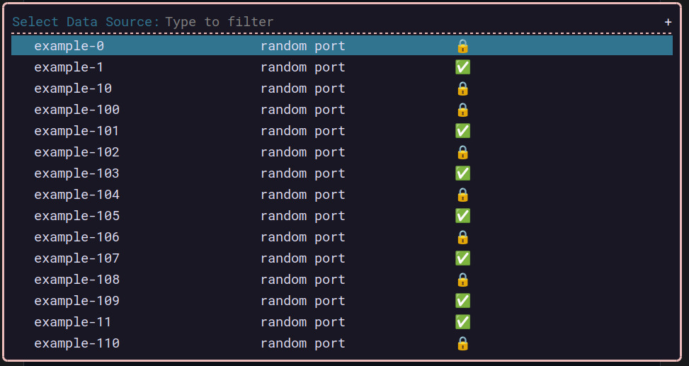
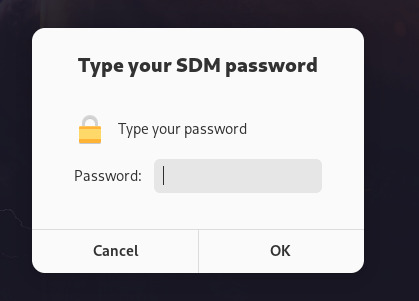

# SDM Wrapper

Why do I need a SDM Wrapper?

- SDM is slow as fuck when it comes to list the status/resources (`sdm status`),
although is possible that that happens because I'm not in the US.
- SDM has no UI for linux, and combined with the "slow" issue makes the experience not so good.
- Because I can.

## How to install

```bash
go install github.com/marianozunino/sdm-ui
```
## How to use

```bash
sdm-ui # to get the help
sdm-ui -h # to get the help
sdm-ui -d # to get debug logging
sdm-ui list # to list the resources (from cache)
sdm-ui rofi <username> # to connect to a resource
sdm-ui sync <username> # sync cache with the "sdm status" output
```

### How does this wrapper solves the above issues?

##### Slow status
Usually the workflow with the sdm cli tool is:
- `sdm status | grep <something>` to get a reduced list of resources
    - e.g. `sdm status | grep rds` to only get the rds resources
- `sdm connect <resource>` to connect to the resource

The wrapper will instead, try to get the resouce list from a cache using [bbolt](https://github.com/etcd-io/bbolt) (overkill? yes. Does it work? fuck yes! and fast too)

- But, when does the cache get populated?
    - Easy, I populate it when I connect to a resource.

##### No UI

I'm not a UI person, but I'm a lazy one. Thus, I really enjoi using [rofi](https://github.com/DaveDavenport/rofi) as a dmenu.

So this wrapper will use rofi to present/select the resource.

||
|:--:|
| *Picture is filled with random data*|

Now when it comes to handle the credentials, this wrapper will use [keyring](https://github.com/tmc/keyring) to store/retrieve the credentials.

If the credentials are not found, it will prompt the user to enter them using [zenity](https://github.com/ncruces/zenity).

||
|:--:|
| *Picture is filled with random data*|


Another utility that I really envy from my coworkers is the fact the `sdm ui` for MacOS will open a browser tab
if you are connecting to a "web" resource (rabbitmq admin page for example).

No more.

I use [open](https://github.com/skratchdot/open-golang) to open the browser. F*ck you 🍏


### Notes

- Did I test this in other environments/OS? Hell no.


